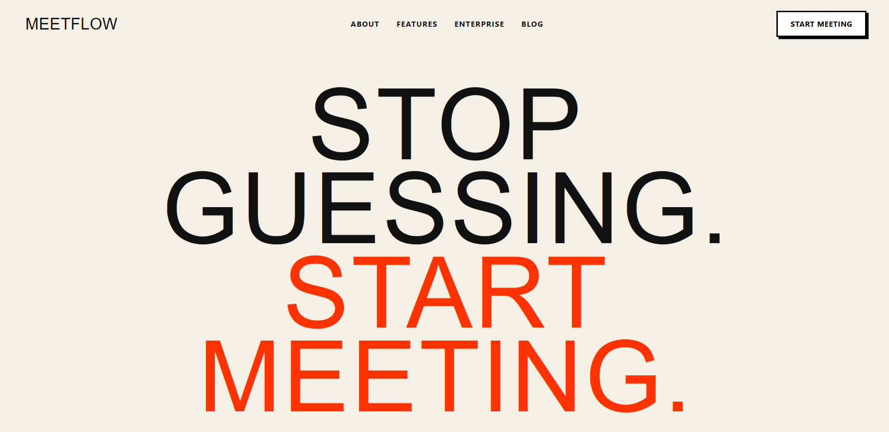
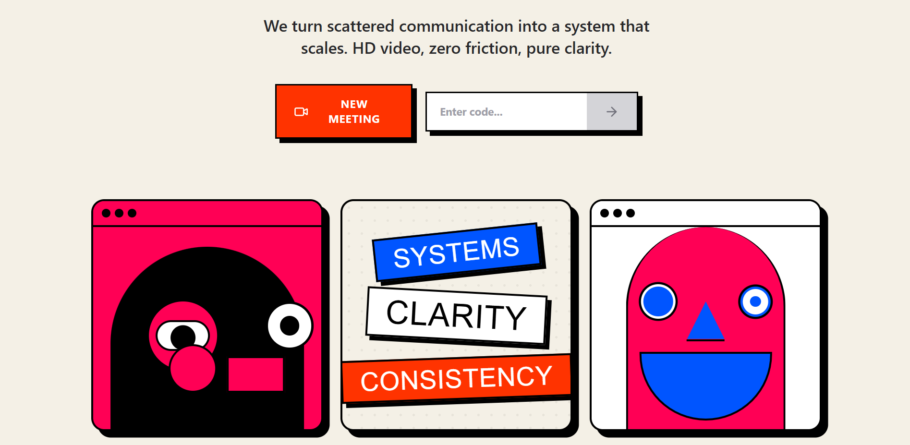
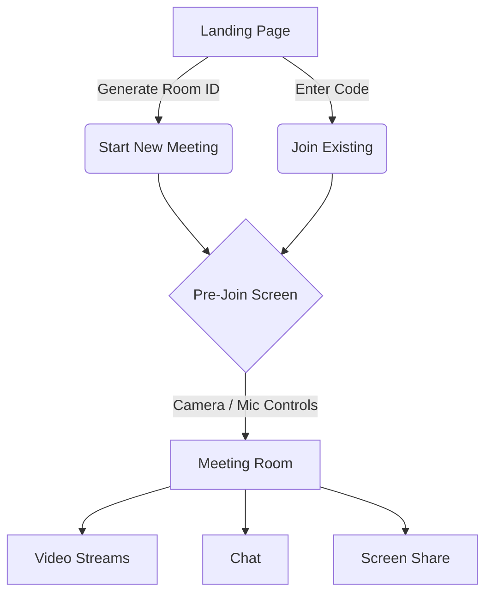
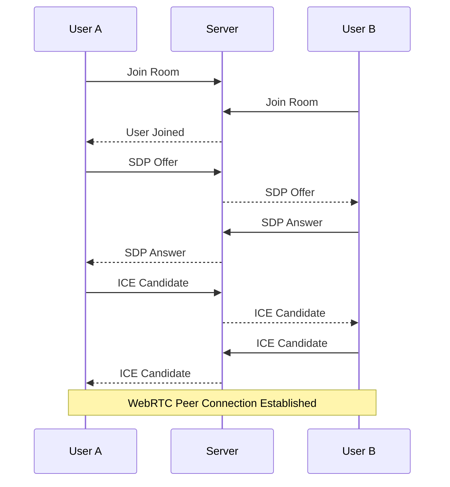

<div align="center">
  
  <h1> MeetFlow</h1>
  <p><strong>A Real-Time, Neo-Brutalist Video Conferencing Platform</strong></p>

  
  
  <br>

  
  
  
  
  
  
</div>

---

##  Welcome to MeetFlow

**MeetFlow** is a modern, real-time video conferencing platform built to explore browser-based communication, peer-to-peer media streaming, and real-time collaboration. With a bold, agency-grade **neo-brutalist** design system, MeetFlow prioritizes both aesthetic impact and seamless functionality.

> ** Status:** Active Development

<br>

<div align="center">
  
  <br>
  <em>The sleek, modern, neo-brutalist landing experience.</em>
</div>

<br>

---

##  Key Features

MeetFlow provides a fast and responsive meeting experience where users can:

*  **Instant Meetings:** Start a new meeting with a single click.
*  **Join via Code:** Easily join an active room using a unique code.
*  **Pre-Join Screen:** Preview camera and microphone before entering the room.
*  **Hardware Controls:** Tactile, interactive buttons to toggle mic and camera states.
*  **Custom Neo-Brutalist UI:** A heavy, bold, high-contrast user interface that stands out.
*  **Real-Time Communication:** Fast, low-latency audio/video streaming via WebRTC (Coming soon!).

---

##  Application Flow & Screens

<div align="center">
  
  <br>
  <em>Immersive video conferencing interface.</em>
</div>

### Navigation Flow



---

##  Technical Architecture

MeetFlow cleanly separates real-time signaling from peer-to-peer media communication.

* **Signaling Layer:** Socket.IO handles connection setup (Room joins, SDP offers, ICE candidates, Disconnect events).
* **Media Layer:** WebRTC manages direct real-time media communication (Camera, Microphone, Screen Sharing).



---

## ⚙️ Getting Started

### Prerequisites

* [Node.js](https://nodejs.org/) & `npm`
* Git
* A modern browser with camera and microphone support

### 1. Clone & Setup

```bash
git clone https://github.com/UBX-CODE/MeetFlow.git
cd MeetFlow
```

### 2. Start the Frontend (Client)

```bash
cd zoom-clone
npm install
npm run dev
```
> The frontend runs at `http://localhost:5173`

### 3. Start the Signaling Server

```bash
cd ../server
npm install
npm run dev
```
> The signaling server runs at `http://localhost:4000` (or your defined PORT)

---

## ⚠️ Current Limitations

As MeetFlow is under active development, note the following:
* Currently heavily focused on a peer-to-peer (mesh) architecture.
* For very large groups, an SFU (Selective Forwarding Unit) architecture would be needed.
* Authentication and persistent meeting histories are planned for future milestones.

---

## 👨‍💻 Author

**UBX-CODE**
* GitHub: [@UBX-CODE](https://github.com/UBX-CODE)

---

<div align="center">
  <p>Built while exploring real-time communication, WebRTC, and modern full-stack engineering.</p>
</div>
